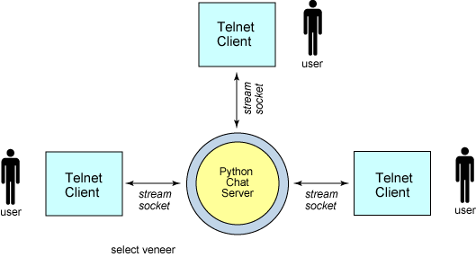

[返回“Python游戏开发基础”目录](<../Python游戏开发基础.qmd>)

## python Socket编程

本教程将向您介绍如何使用 Python 开发基于 socket 的网络应用程序。在本教程中，您将首先学习一些 Python 的基础知识，并了解 Python 是如何成为一种很好的网络编程语言的。然后您将着重了解 Python 的基本 socket 特性，我们使用了一个样例聊天程序作为参考；并了解一下可以提供异步通信的其他高级类。

### 开始之前

#### 关于本教程

Python 是一个流行的面向对象的脚本语言，其语法非常简单，有大量的开发人员采用它。它是一种通用的语言，可以在各种环境中使用。它也是初学者常用的一种语言，就像是 20 世纪 70 年代的 BASIC 一样。

本教程重点介绍了 Python 语言在网络编程方面的知识。我定义了 Python 的一些基本 socket 特性，以及可以提供异步 socket 的另外一些高级类。我还详细介绍了 Python 的应用层协议类，展示了如何构建 Web 客户机、邮件服务器和客户机等等。

在本教程中我们还开发了一个简单的聊天服务器，从而展示 Python 在 socket 应用程序方面的强大功能。

您应该对标准的 BSD socket API 有基本的了解，并且具有使用 GNU/Linux® 环境的经验。如果熟悉面向对象的概念会很有帮助。

#### 前提条件

本教程以及本教程中所展示的例子使用的都是 2.4 版本的 Python。可以从 Python Web 站点上下载这个版本（请参阅 参考资料 中的链接）。要编译 Python 解释器，需要使用 GNU C 编译器（gcc）和 configure/make 工具（任何标准的 GNU/Linux 发行版中都包含这个工具）。

您应该对标准的 BSD Sockets API 有基本的了解，并且具有使用 GNU/Linux 环境的经验。如果熟悉面向对象的概念将会很有帮助。

### Python 简介

首先，让我们来体验一下 Python。

#### 什么是 Python？

Python 是一种通用的面向对象脚本语言，可以在各种平台上使用。Python 是在 20 世纪 90 年代在 Amsterdam 的 CWI 诞生的，目前由 Python 软件基金会进行资助。

Python 具有迷人的可移植特性，几乎在所有操作系统上都可以找到它。

Python 是一种解释性的语言，很容易进行扩展。可以使用 C 或 C++ 函数通过添加包含函数、变量和类型的新模块来对 Python 进行扩展。

也可以在 C 或 C++ 程序中非常方便地嵌入 Python 程序，这样就可以对应用程序进行扩展，使其具有脚本的功能。

Python 最有用的一点是它具有大量的扩展模块。这些模块提供了一些标准的功能，例如字符串或列表处理；还有一些应用级的模块，用来进行视频和图像处理、声音处理和网络处理。

#### 体验 Python

下面我们先对 Python 是什么建立一个直观印象。

作为一种解释性语言，Python 很容易使用，并且能够快速验证我们的想法和开发原型软件。Python 程序可以作为一个整体进行解释，也可以一行行地解释。

可以在第一次运行 Python 时测试一下下面的 Python 代码，然后一次只输入一行试试。在 Python 启动之后，会显示一个提示符（>>>），可以在这里输入命令。 注意在 Python 中，缩进非常重要，因此代码前面的空格不能忽略：

- 清单 1. 可以试验的几个 Python 例子
```python
# Open a file, read each line, and print it out
for line in open('file.txt'):
  print line

# Create a file and write to it
file = open("test.txt", "w")
file.write("test line\n")
file.close()

# Create a small dictionary of names and ages and manipulate
family = {'Megan': 13, 'Elise': 8, 'Marc': 6}

# results in 8
family['Elise']

# Remove the key/value pair
del family['Elise']

# Create a list and a function that doubles its input.  Map the
#    function to each of the elements of the list (creating a new
#    list as a result).
arr = [1, 2, 3, 4, 5]
def double(x): return x*x
map(double, arr)

# Create a class, inherit by another, and then instantiate it and
#    invoke its methods.
class Simple:
  def __init__(self, name):
    self.name = name

  def hello(self):
    print self.name+" says hi."

class Simple2(Simple):
  def goodbye(self):
    print self.name+" says goodbye."

me = Simple2("Tim")
me.hello()
me.goodbye()
```

#### 为什么使用 Python？

我们要学习和使用 Python 的一个原因是它非常流行。Python 用户的数量以及使用 Python 编写的应用程序的不断增长使这种努力是值得的。

在很多开发领域中都可以看到 Python 的踪迹，它被用来构建系统工具，用作程序集成的黏合剂，用来开发 Internet 应用程序和快速开发原型。

Python 与其他脚本语言相比也有一定的优势。它的语法非常简单，概念非常清晰，这使得 Python 非常容易学习。在使用复杂的数据结构（例如列表、词典和元组）时，Python 也非常简单，而且可描述性更好。Python 还可以对语言进行扩充，也可以由其他语言进行扩充。

我发现 Python 的语法使它比 Perl 的可读性和可维护性更好，但是比 Ruby 要差。与 Ruby 相比，Python 的优点在于它有大量的库和模块可以使用。使用这些库和模块，只需要很少的代码就可以开发功能丰富的程序。

Python 使用缩进格式来判断代码的作用域，这有些讨厌，但是 Python 本身的简单性使这个问题已经微不足道了。

现在，让我们开始进入 Python 中的 socket 编程世界。

### Python socket 模块

#### 基本的 Python socket 模块

Python 提供了两个基本的 socket 模块。第一个是 Socket，它提供了标准的 BSD Sockets API。第二个是 SocketServer，它提供了服务器中心类，可以简化网络服务器的开发。Python 使用一种异步的方式来实现这种功能，您可以提供一些插件类来处理服务器中应用程序特有的任务。表 1 列出了本节所涉及的类和模块。

- 表 1. Python 类和模块
| 类/模块 | 说明 |
| --- | --- |
| Socket | 低层网络接口（每个 BSD API） |
| SocketServer | 提供简化网络服务器开发的类 |

让我们来看一下这些模块，以便理解它们是如何工作的。

#### socket 模块

Socket 模块提供了 UNIX® 程序员所熟悉的基本网络服务（也称为 BSD API）。这个模块中提供了在构建 socket 服务器和客户机时所需要的所有功能。

这个 API 与标准的 C API 之间的区别在于它是面向对象的。在 C 中，socket 描述符是从 socket 调用中获得的，然后会作为一个参数传递给 BSD API 函数。在 Python 中，socket 方法会向应用 socket 方法的对象返回一个 socket 对象。表 2 给出了几个类方法，表 3 显示了一部分实例方法。

- 表 2. Socket 模块的类方法
| 类方法 | 说明 |
| --- | --- |
| Socket | 低层网络接口（每个 BSD API） |
| socket.socket(family, type) | 创建并返回一个新的 socket 对象 |
| socket.getfqdn(name) | 将使用点号分隔的 IP 地址字符串转换成一个完整的域名 |
| socket.gethostbyname(hostname) | 将主机名解析为一个使用点号分隔的 IP 地址字符串 |
| socket.fromfd(fd, family, type) | 从现有的文件描述符创建一个 socket 对象 |

- 表 3. Socket 模块的实例方法
| 实例方法 | 说明 |
| --- | --- |
| sock.bind( (adrs, port) ) | 将 socket 绑定到一个地址和端口上 |
| sock.accept() | 返回一个客户机 socket（带有客户机端的地址信息） |
| sock.listen(backlog) | 将 socket 设置成监听模式，能够监听 backlog 外来的连接请求 |
| sock.connect( (adrs, port) ) | 将 socket 连接到定义的主机和端口上 |
| sock.recv( buflen[, flags] ) | 从 socket 中接收数据，最多 buflen 个字符 |
| sock.recvfrom( buflen[, flags] ) | 从 socket 中接收数据，最多 buflen 个字符，同时返回数据来源的远程主机和端口号 |
| sock.send( data[, flags] ) | 通过 socket 发送数据 |
| sock.sendto( data[, flags], addr ) | 通过 socket 发送数据 |
| sock.close() | 关闭 socket |
| sock.getsockopt( lvl, optname ) | 获得指定 socket 选项的值 |
| sock.setsockopt( lvl, optname, val ) | 设置指定 socket 选项的值 |

类方法 和 实例方法 之间的区别在于，实例方法需要有一个 socket 实例（从 socket 返回）才能执行，而类方法则不需要。

#### SocketServer 模块

SocketServer 模块是一个十分有用的模块，它可以简化 socket 服务器的开发。有关这个模块的使用的讨论已经远远超出了本教程的范围，但是我将展示一下它的基本用法，然后您可以参阅 参考资料 一节中给出的链接。

考虑清单 2 中给出的例子。此处，我们实现了一个简单的 “Hello World” 服务器，当客户机连接它时，它就会显示这样一条消息。我首先创建一个请求处理程序，它继承了 SocketServer.StreamRequestHandler 类。我们定义了一个名为 handle 的方法，它处理服务器的请求。服务器所做的每件事情都必须在这个函数的上下文中进行处理（最后，关闭这个 socket）。这个过程的工作方式非常简单，但是您可以使用这个类来实现一个简单的 HTTP 服务器。在 handle 方法中，我们打一个招呼就退出了。

现在连接处理程序已经准备就绪了，剩下的工作是创建 socket 服务器。我们使用了 SocketServer.TCPServer 类，并提供了地址和端口号（要将服务器绑定到哪个端口上）以及请求处理方法。结果是一个 TCPServer 对象。调用 serve_forever 方法启动服务器，并使其对这个连接可用。

- 清单 2. 用 SocketServer 模块实现一个简单的服务器
```python
import SocketServer

class hwRequestHandler( SocketServer.StreamRequestHandler ):
  def handle( self ):
    self.wfile.write("Hello World!\n")

server = SocketServer.TCPServer( ("", 2525), hwRequestHandler )
server.serve_forever()
```

就是这样！Python 允许这种机制的任何变种，包括 UDPServers 以及派生进程和线程的服务器。请参阅 参考资料 一节中更多信息的链接。

### Python 中的 socket 编程

在所有具有 socket 的语言中，socket 都是相同的 —— 这是两个应用程序彼此进行通信的管道。

#### 前提条件

不管是使用 Python、Perl、Ruby、Scheme 还是其他有用的语言（此处 有用 的意思是这种语言有 socket 接口）来编写 socket 程序，socket 通常都是相同的。这是两个应用程序彼此进行通信的管道（这两个应用程序可以在同一台机器上，也可以位于两台不同的机器上）。

使用 Python 这种具有 socket 编程功能的语言的区别在于，它有一些辅助的类和方法，可以简化 socket 编程。在本节中，我们将展示 Python 的 socket API。可以使用一个脚本来执行 Python 的解释器，如果您要自己执行 Python，就可以一次只输入一行代码。这样，就可以看到每个方法调用之后的结果了。

下面这个例子展示了如何与 Python 解释器进行交互。此处我们使用了 socket 类方法 gethostbyname 将一个完整的域名（www.ibm.com）解析成一个使用点号分隔的 IP 地址字符串（'129.42.19.99'）：

- 清单 3. 从解释器命令行中使用 socket
```
[camus]$ python
Python 2.4 (#1, Feb 20 2005, 11:25:45)
[GCC 3.2.2 20030222 (Red Hat Linux 3.2.2-5)] on linux2
Type "help", "copyright", "credits" or "license" for more
   information.
>>> import socket
>>> socket.gethostbyname('www.ibm.com')
'129.42.19.99'
>>>
```

在导入 socket 模块之后，我调用了 gethostbyname 类方法将这个域名解析成 IP 地址。

现在，我们要讨论基本的 socket 方法，并通过 socket 进行通信。您应该熟悉 Python 解释器。

#### 创建和销毁 socket

要新创建一个 socket，可以使用 socket 类的 socket 方法。这是一个类方法，因为还没有得到可以应用方法的 socket 对象。socket 方法与 BSD API 类似，下面是创建流（TCP） socket 和数据报（UDP）socket 的方法：

- 清单 4. 创建流和数据报 socket
```python
streamSock = socket.socket( socket.AF_INET, socket.SOCK_STREAM )
dgramSock = socket.socket( socket.AF_INET, socket.SOCK_DGRAM )
```

在这种情况中，会返回一个 socket 对象。AF_INET 符号（第一个参数）说明您正在请求的是一个 Internet 协议（IP） socket，具体来说是 IPv4。第二个参数是传输协议的类型（SOCK_STREAM 对应 TCP socket，SOCK_DGRAM 对应 UDP socket）。如果底层操作系统支持 IPv6，那么还可以指定 socket.AF_INET6 来创建一个 IPv6 socket。

要关闭一个已经连接的 socket，可以使用 close 方法：
```python
streamSock.close()
```

最后，可以使用 del 语句删除一个 socket：
```python
del streamSock
```

这个语句可以永久地删除 socket 对象。之后再试图引用这个对象就会产生错误。

#### Socket 地址

socket 地址是一个组合，包括一个接口地址和一个端口号。由于 Python 可以很简单地表示元组，因此地址和端口也可以这样表示。下面表示的是接口地址 192.168.1.1 和端口 80：
```python
( '192.168.1.1', 80 )
```

也可以使用完整的域名，例如：
```python
( 'www.ibm.com', 25 )
```

这个例子非常简单，当然比使用 C 编写相同功能的程序时对 sockaddr_in 进行操作要简单很多。下面的讨论给出了 Python 中地址的例子。

#### 服务器 socket

服务器 socket 通常会在网络上提供一个服务。由于服务器和客户机的 socket 是使用不同的方式创建的，因此我们将分别进行讨论。

在创建 socket 之后，可以使用 bind 方法来绑定一个地址，listen 方法可以将其设置为监听状态，最后 accept 方法可以接收一个新的客户机连接。下面展示了这种用法：

- 清单 5. 使用服务器 socket
```python
sock = socket.socket( socket.AF_INET, socket.SOCK_STREAM )
sock.bind( ('', 2525) )
sock.listen( 5 )
newsock, (remhost, remport) = sock.accept()
```

对于这个服务器来说，使用地址 (*, 2525) 就意味着接口地址中使用了通配符 (*)，这样可以接收来自这个主机上的任何接口的连接。还说明要绑定到端口 2525 上。

注意此处 accept 方法不但要返回一个新的 socket 对象，它表示了客户机连接（newsock）；而且还要返回一个地址对（socket 端的远程地址和端口号）。Python 的 SocketServer 模块可以对这个过程进一步进行简化，正如上面展示的一样。

虽然也可以创建数据报服务器，不过这是无连接的，因此没有对应的 accept 方法。下面的例子创建一个数据报服务器 socket：

- 清单 6. 创建一个数据报服务器 socket
```python
sock = socket.socket( socket.AF_INET, socket.SOCK_DGRAM )
sock.bind( ('', 2525) )
```

后面对于 socket I/O 的讨论将说明 I/O 是如何为流 socket 和数据报 socket 工作的。

现在，让我们来看一下客户机是如何创建 socket 并将其连接到服务器上的。

#### 客户机 socket

客户机 socket 的创建和连接机制与服务器 socket 相似。在创建 socket 之前，都需要一个地址 —— 不是本地绑定到这个 socket 上（就像服务器 socket 的情况那样），而是标识这个 socket 应该连接到什么地方。假设在这个主机的 IP 地址 '192.168.1.1' 和端口 2525 上有一个服务器。下面的代码可以创建一个新的 socket，并将其连接到定义的服务器上：

- 清单 7. 创建一个流 socket 并将其连接到服务器上
```python
sock = socket.socket( socket.AF_INET, socket.SOCK_STREAM )
sock.connect( ('192.168.1.1', 2525) )
```

对于数据报 socket 来说，处理过程稍有不同。回想一下，数据报从本质上来说都是没有连接的。可以这样考虑：流 socket 是两个点之间的通信管道，而数据报 socket 是基于消息的，可以同时与多个点进行通信。下面是一个数据报客户机的例子。

清单 8. 创建一个数据报 socket 并将其连接到服务器上
```python
sock = socket.socket( socket.AF_INET, sock.sock_DGRAM )
sock.connect( ('192.168.1.1', 2525) )
```

尽管我们使用了 connect 方法，但是此处是有区别的：在客户机和服务器之间并不存在真正的 连接。此处的连接是对以后 I/O 的一个简化。通常在数据报 socket 中，必须在所发送的数据中提供目标地址的信息。通过使用 connect，我们可以使用客户机对这些信息进行缓存，并且 send 方法的使用可以与流 socket 情况一样（只不过不需要目标地址）。可以再次调用 connect 来重新指定数据报客户机消息的目标。

#### 流 socket I/O

通过流 socket 发送和接收数据在 Python 中是很简单的。有几个方法可以用来通过流 socket 传递数据（例如 send、recv、read 和 write）。

第一个例子展示了流 socket 的服务器和客户机。在这个例子中，服务器会回显从客户机接收到的信息。

回显流服务器如清单 9 所示。在创建一个新的流 socket 之前，需要先绑定一个地址（接收来自任何接口和 45000 端口的连接），然后调用 listen 方法来启用到达的连接。这个回显服务器然后就可以循环处理各个客户机连接了。它会调用 accept 方法并阻塞（即不会返回），直到有新的客户机连接到它为止，此时会返回新的客户机 socket，以及远程客户机的地址信息。使用这个新的客户机 socket，我们可以调用 recv 来从另一端接收一个字符串，然后将这个字符串写回这个 socket。然后立即关闭这个 socket。

清单 9. 简单的 Python 流回显服务器
```python
import socket

srvsock = socket.socket( socket.AF_INET, socket.SOCK_STREAM )
srvsock.bind( ('', 23000) )
srvsock.listen( 5 )

while 1:
  clisock, (remhost, remport) = srvsock.accept()
  str = clisock.recv(100)
  clisock.send( str )
  clisock.close()
```

清单 10 显示了与清单 9 的回显服务器对应的客户机。在创建一个新的流程 socket 之前，需要使用 connect 方法将这个 socket 连接到服务器上。当连接之后（connect 方法返回），客户机就会使用 send 方法输出一条简单的文本消息，然后使用 recv 方法等待回显。print 语句用来显示所读取的内容。当这个过程完成之后，就执行 close 方法关闭 socket。

清单 10. 简单的 Python 流回显客户机
```python
import socket

clisock = socket.socket( socket.AF_INET, socket.SOCK_STREAM )

clisock.connect( ('', 23000) )

clisock.send("Hello World\n")
print clisock.recv(100)

clisock.close()
```

#### 数据报 socket I/O

数据报 socket 天生就是无连接的，这意味着通信需要提供一个目标地址。类似，当通过一个 socket 接收消息时，必须同时返回数据源。recvfrom 和 sendto 方法可以支持其他地址，正如您在数据报回显服务器和客户机实现中可以看到的一样。

清单 11 显示了数据报回显服务器的代码。首先创建一个 socket，然后使用 bind 方法绑定到一个地址上。然后进入一个无限循环来处理客户机的请求。recvfrom 方法从一个数据报 socket 接收消息，并返回这个消息以及发出消息的源地址。这些信息然后会被传入 sendto 方法，将这些消息返回到源端。

清单 11. 简单的 Python 数据报回显服务器
```python
import socket

dgramSock = socket.socket( socket.AF_INET, socket.SOCK_DGRAM )
dgramSock.bind( ('', 23000) )

while 1:
  msg, (addr, port) = dgramSock.recvfrom( 100 )
  dgramSock.sendto( msg, (addr, port) )
```

数据报客户机更加简单。在创建数据报 socket 之后，我们使用 sendto 方法将一条消息发送到一个指定的地址。（记住：数据报是无连接的。）在 sendto 完成之后，我们使用 recv 来等待回显的响应，然后打印所收到的信息。注意此处我们并没有使用 recvfrom，这是因为我们对两端的地址信息并不感兴趣。

清单 12. 简单的 Python 数据报回显客户机
```python
import socket

dgramSock = socket.socket( socket.AF_INET, socket.SOCK_DGRAM )

dgramSock.sendto( "Hello World\n", ('', 23000) )
print dgramSock.recv( 100 )
dgramSock.close()
```

#### socket 选项

socket 在缺省情况下有一些标准的行为，但是可以使用一些选项来修改 socket 的行为。我们可以使用 setsockopt 方法来修改 socket 的选项，并使用 getsockopt 方法来读取 socket 选项的值。

在 Python 中使用 socket 选项非常简单，正如清单 13 所示。在第一个例子中，我们读取的是 socket 发送缓冲区的大小。在第二个例子中，我们获取 SO_REUSEADDR 选项的值（重用 TIME_WAIT 中的地址），然后来启用它。

清单 13. 使用 socket 选项
```python
sock = socket.socket( socket.AF_INET, socket.SOCK_STREAM )

# Get the size of the socket's send buffer
bufsize = sock.getsockopt( socket.SOL_SOCKET, socket.SO_SNDBUF )

# Get the state of the SO_REUSEADDR option
state = sock.getsockopt( socket.SOL_SOCKET, socket.SO_REUSEADDR )

# Enable the SO_REUSEADDR option
sock.setsockopt( socket.SOL_SOCKET, socket.SO_REUSEADDR, 1 )
```

SO_REUSEADDR 选项通常是在 socket 服务器的开发中使用的。可以增大 socket 的发送和接收缓冲区，从而获得更好的性能，但是记住您是在一个解释脚本中进行操作的，因此可能不会带来太多益处。

#### 异步 I/O

Python 作为 select 模块的一部分提供了异步 I/O 的功能。这种特性与 C 的 select 机制类似，但是更加简单。我们首先对 select 进行简介，然后解释如何在 Python 中使用。

select 方法允许对多个 socket 产生多个事件或多个不同的事件。例如，您可以告诉 select 当 socket 上有数据可用时、当可以通过一个 socket 写入数据时以及在 socket 上发生错误时，都要通知您；可以同时为多个 socket 执行这些操作。

在 C 使用位图的地方，Python 使用列表来表示要监视的描述符，并且返回那些满足约束条件的描述符。在下面的例子中，等待从标准输入设备上输入信息：

清单 14. 等待 stdin 的输入
```python
import select
rlist, wlist, elist = select.select( [sys.stdin], [], [] )

print sys.stdin.read()
```

传递给 select 的参数是几个列表，分别表示读事件、写事件和错误事件。select 方法返回三个列表，其中包含满足条件的对象（读、写和异常）。在这个例子中，返回的 rlist 应该是 [sys.stdin]，说明数据在 stdin 上可用了。然后就可以使用 read 方法来读取这些数据。

select 方法也可以处理 socket 描述符。在下面的例子（请参阅清单 15）中，我们创建了两个客户机 socket，并将其连接到一个远程端上。然后使用 select 方法来确定哪个 socket 可以读取数据了。接着可以读取这些数据，并将其显示到 stdout 上。

清单 15. 展示处理多个 socket 的 select 方法
```python
import socket
import select

sock1 = socket.socket( socket.AF_INET, socket.SOCK_STREAM )
sock2 = socket.socket( socket.AF_INET, socket.SOCK_STREAM )

sock1.connect( ('192.168.1.1', 25) )
sock2.connect( ('192.168.1.1', 25) )

while 1:
  # Await a read event
  rlist, wlist, elist = select.select( [sock1, sock2], [], [], 5 )

  # Test for timeout
  if [rlist, wlist, elist] == [ [], [], [] ]:
    print "Five seconds elapsed.\n"
  else:
    # Loop through each socket in rlist, read and print the available data
    for sock in rlist:
      print sock.recv( 100 )
```

### 构建一个 Python 聊天服务器

#### 一个简单的聊天服务器

现在您已经了解了 Python 中基本的网络 API；接下来可以在一个简单的应用程序中应用这些知识了。在本节中，将构建一个简单的聊天服务器。使用 Telnet，客户机可以连接到 Python 聊天服务器上，并在全球范围内相互进行通信。提交到聊天服务器的消息可以由其他人进行查看（以及一些管理信息，例如客户机加入或离开聊天服务器）。这个模型如图 1 所示。

图 1. 聊天服务器使用 select 方法来支持任意多个客户机



聊天服务器的一个重要需求是必须可以伸缩。服务器必须能够支持任意个流（TCP）客户机。

要支持任意个客户机，可以使用 select 方法来异步地管理客户机的列表。不过也可以使用服务器 socket 的 select 特性。select 的读事件决定了一个客户机何时有可读数据，而且它也可以用来判断何时有一个新客户机要连接服务器 socket 了。可以利用这种行为来简化服务器的开发。

接下来，我们将展示聊天服务器的 Python 源代码，并说明 Python 怎样帮助简化这种实现。

#### ChatServer 类

让我们首先了解一下 Python 聊天服务器类和 `__init__` 方法 —— 这是在创建新实例时需要调用的构造函数。

这个类由 4 个方法组成。run 方法用来启动服务器，并且允许客户机的连接。broadcast_string 和 accept_new_connection 方法在类内部使用，我们稍后就会讨论。

`__init__` 方法是一个特殊的方法，它们会在创建一个类的新实例时调用。注意所有的方法都使用一个 self 参数，这是对这个类实例本身的引用（与 C++ 中的 this 参数非常类似）。这个 self 参数是所有实例方法的一部分，此处用来访问实例变量。

`__init__` 方法创建了 3 个实例变量。port 是服务器的端口号（传递给构造函数）。srvsock 是这个实例的 socket 对象，descriptors 是一个列表，包含了这个类中的每个 socket 对象。可以在 select 方法中使用这个列表来确定读事件的列表。

最后，清单 16 给出了 `__init__` 方法的代码。在创建一个流 socket 之后，就可以启用 SO_REUSEADDR socket 选项了；这样如果需要，服务器就可以快速重新启动了。通配符地址被绑定到预先定义好的端口号上。然后调用 listen 方法，从而允许到达的连接接入。服务器 socket 被加入到 descriptors 列表中（现在只有一个元素），但是所有的客户机 socket 都可以在到达时被加入到这个列表中（请参阅 accept_new_connection）。此时会在 stdout 上打印一条消息，说明这个服务器已经被启动了。

清单 16. ChatServer 类的 init 方法
```python
import socket
import select

class ChatServer:
  def __init__( self, port ):
    self.port = port;

    self.srvsock = socket.socket( socket.AF_INET, socket.SOCK_STREAM )
    self.srvsock.setsockopt( socket.SOL_SOCKET, socket.SO_REUSEADDR, 1 )
    self.srvsock.bind( ("", port) )
    self.srvsock.listen( 5 )

    self.descriptors = [self.srvsock]
    print 'ChatServer started on port %s' % port

  def run( self ):
    ...

  def broadcast_string( self, str, omit_sock ):
    ...

  def accept_new_connection( self ):
    ...
```

#### run 方法

run 方法对于聊天服务器来说是一个循环（请参阅清单 17）。在调用时，它还会进入一个无限循环，并在连接的客户机之间进行通信。

服务器的核心是 select 方法。我将 descriptor 列表（其中包含了所有服务器的 socket）作为读事件的列表传递给 select （写事件和异常事件列表都为空）。当检测到读事件时，它会作为 sread 返回。（我们忽略了 swrite 和 sexc 列表。）sread 列表包含要服务的 socket 对象。我们循环遍历这个 sread 列表，检查每个找到的 socket 对象。

在这个循环中首先检查 socket 对象是否是服务器。如果是，就说明一个新的客户机正在试图连接，这就要调用 accept_new_connection 方法。否则，就读取客户机的 socket。如果 recv 返回 NULL，那就关闭 socket。

在这种情况中，我们构建了一条消息，并将其发送给所有已经连接的客户机，然后关闭 socket，并从 descriptor 列表中删除对应的对象。如果 recv 返回值不是 NULL，那么就说明已经有消息可用了，它被存储在 str 中。这条消息会使用 broadcast_string 发送给其他所有的客户机。

清单 17. 聊天服务器的 run 方法是这个聊天服务器的核心
```python
def run( self ):

  while 1:

    # Await an event on a readable socket descriptor
    (sread, swrite, sexc) = select.select( self.descriptors, [], [] )

    # Iterate through the tagged read descriptors
    for sock in sread:

      # Received a connect to the server (listening) socket
      if sock == self.srvsock:
        self.accept_new_connection()
      else:

        # Received something on a client socket
        str = sock.recv(100)

        # Check to see if the peer socket closed
        if str == '':
          host,port = sock.getpeername()
          str = 'Client left %s:%s\r\n' % (host, port)
          self.broadcast_string( str, sock )
          sock.close
          self.descriptors.remove(sock)
        else:
          host,port = sock.getpeername()
          newstr = '[%s:%s] %s' % (host, port, str)
          self.broadcast_string( newstr, sock )
```

#### 辅助方法

在这个聊天服务器中有两个辅助方法，提供了接收新客户机连接和将消息广播到已连接的客户机上的功能。

当在到达连接队列中检测到一个新的客户机时，就会调用 accept_new_connection 方法（请参阅清单 18）。accept 方法用来接收这个连接，它会返回一个新的 socket 对象，以及远程地址信息。我们会立即将这个新的 socket 加入到 descriptors 列表中，然后向这个新的客户机输出一条消息欢迎它加入聊天。我创建了一个字符串来表示这个客户机已经连接了，使用 broadcast_string 方法来成组地广播这条消息（请参阅清单 19）。

注意，除了要广播的字符串之外，还要传递一个 socket 对象。原因是我们希望有选择地忽略一些 socket，从而只接收特定的消息。例如，当一个客户机向一个组中发送一条消息时，这条消息应该发送给这个组中除了自己之外的所有人。当我们生成状态消息来说明有一个新的客户机正在加入该组时，这条消息也不应该发送给这个新客户机，而是应该发送给其他所有人。这种任务是在 broadcast_string 中使用 omit_sock 参数实现的。这个方法会遍历 descriptors 列表，并将这个字符串发送给那些不是服务器 socket 且不是 omit_sock 的 socket。

清单 18. 在聊天服务器上接收一个新客户机连接
```python
def accept_new_connection( self ):

  newsock, (remhost, remport) = self.srvsock.accept()
  self.descriptors.append( newsock )

  newsock.send("You're connected to the Python chatserver\r\n")
  str = 'Client joined %s:%s\r\n' % (remhost, remport)
  self.broadcast_string( str, newsock )
```

清单 19. 将一条消息在聊天组中广播
```python
def broadcast_string( self, str, omit_sock ):
  for sock in self.descriptors:
    if sock != self.srvsock and sock != omit_sock:
      sock.send(str)
  print str,
```

#### 实例化一个新的 ChatServer

现在您已经看到了 Python 聊天服务器（这只使用了不到 50 行的代码），现在让我们看一下如何在 Python 中实例化一个新的聊天服务器。

我们通过创建一个新的 ChatServer 对象来启动一个服务器（传递要使用的端口号），然后调用 run 方法来启动服务器并允许接收所有到达的连接：

清单 20. 实例化一个新的聊天服务器
```python
myServer = ChatServer( 2626 )
myServer.run()
```

现在，这个服务器已经在运行了，您可以从一个或多个客户机连接到这个服务器上。也可以将几个方法串接在一起来简化这个过程（如果需要简化的话）：

清单 21. 串接几个方法
```python
myServer = ChatServer( 2626 ).run()
```

这可以实现相同的结果。下面我们将展示 ChatServer 类的用法。

#### 展示 ChatServer

下面就是 ChatServer 的用法。我们将展示 ChatServer 的输出结果（请参阅清单 22 ）以及两个客户机之间的对话（请参阅清单 23 和 清单 24）。用户输入的文本以黑体形式表示。

清单 22. ChatServer 的输出
```
[plato]$ python pchatsrvr.py
ChatServer started on port 2626
Client joined 127.0.0.1:37993
Client joined 127.0.0.1:37994
[127.0.0.1:37994] Hello, is anyone there?
[127.0.0.1:37993] Yes, I'm here.
[127.0.0.1:37993]  Client left 127.0.0.1:37993
```

清单 23. 聊天客户机 #1 的输出
```
[plato]$ telnet localhost 2626
Trying 127.0.0.1...
Connected to localhost.localdomain (127.0.0.1).
Escape character is '^]'.
You're connected to the Python chatserver
Client joined 127.0.0.1:37994
[127.0.0.1:37994] Hello, is anyone there?
Yes, I'm here.
					^]
telnet> close
Connection closed.
[plato]$
```

清单 24. 聊天客户机 #2 的输出
```
[plato]$ telnet localhost 2626
Trying 127.0.0.1...
Connected to localhost.localdomain (127.0.0.1).
Escape character is '^]'.
You're connected to the Python chatserver
Hello, is anyone there?
[127.0.0.1:37993] Yes, I'm here.
[127.0.0.1:37993] Client left 127.0.0.1:37993
```

正如您在清单 22 中看到的那样，所有客户机之间的对话都会显示到 stdout 上，包括客户机的连接和断开消息。

### 高级网络类

#### 网络模块

Python 包括几个专门用于应用层协议的模块（它们是在标准的 socket 模块上构建的）。可用模块有很多，提供了超文本传输协议（HTTP）、简单邮件传输协议（SMTP）、Internet 消息访问协议（IMAP）、邮局协议（POP3）、网络新闻传输协议（NNTP）、XML-PRC（远程过程调用）、FTP 以及很多其他的协议。

本节将展示表 4 中列出的模块的用法。

表 4. 有用的应用层协议模块
| 模块 | 所实现的协议 |
| --- | --- |
| httplib | HTTP 客户机 |
| smtplib | SMTP 客户机 |
| poplib | POP3 客户机 |

#### httplib （HTTP 客户机）

HTTP 客户机接口在开发 Web 机器人或其他流 socket 时非常有用。Web 协议本质上是通过流 socket 进行请求/响应的。Python 通过一个简单的 Web 接口来简化构建 Web 机器人的过程。

清单 25 展示了 httplib 模块的用法。使用 HTTPConnection 创建了一个 HTTP 的实例，这里需要提供想要连接的 Web 站点。使用这个新对象（httpconn），可以使用 request 方法来请求文件。在 request 方法中，可以指定 HTTP GET 方法（从服务器上请求一个文件，而 HEAD 只简单地获取有关这个文件的信息）。getresponse 方法会对 HTTP 响应头进行解析，从而了解是否碰到了错误。如果成功地接收到了这个文件，那么这个新响应对象的 read 方法就返回并打印一条文本信息。

清单 25. 使用 httplib 构建一个简单的 HTTP 客户机
```python
import httplib

httpconn = httplib.HTTPConnection("www-130.ibm.com")

httpconn.request("GET", "/developerworks/index.html")

resp = httpconn.getresponse()

if resp.reason == "OK":

  resp_data = resp.read()

  print resp_data

httpconn.close()
```

#### smptlib（SMTP 客户机）

SMTP 让您可以发送 e-mail 消息到一台邮件服务器上，这对于在网络系统中传递有关设备操作的状态非常有用。发送 e-mail 的 Python 模块非常简单，包括创建一个 SMTP 对象，使用 sendmail 方法发送一条 e-mail 消息，然后使用 quit 方法关闭这个连接。

清单 26 中的例子展示了发送一个简单 e-mail 消息的方法。msg 字符串中包含了邮件的主体（它应该包含主题行）。

清单 26. 使用 smtplib 发送一条简短的 e-mail 消息
```python
import smtplib

fromAdrs = 'mtj@mtjones.com'
toAdrs = 'you@mail.com'
msg = 'From: me@mail.com\r\nTo: you@mail.com\r\nSubject:Hello\r\nHi!\r\n'

mailClient = smtplib.SMTP('192.168.1.1')
mailClient.sendmail( fromAdrs, toAdrs, msg )
mailClient.quit
```

#### poplib（POP3 客户机）

POP3 是另外一个非常有用的应用层协议，在 Python 中也有一个这种模块。POP3 协议让您可以连接到一个邮件服务器上，并下载新的邮件，这对于远程命令来说非常有用 —— 可以在 e-mail 消息的正文中嵌入命令。在执行嵌入的命令之后，可以使用 smptlib 向源返回一条 e-mail 消息。

清单 27 展示了一个简单的应用程序，它连接到一台邮件服务器上，并为这个用户打印所有未读的 e-mail 的主题行。

poplib 相当简单，但是它为在服务器上搜集和管理 e-mail 提供了几种方法。在这个例子中，我们使用 POP3 方法创建了一个新的 POP3 对象，这个方法要指定邮件服务器。user 和 pass_ 方法将向服务器验证应用程序；stat 方法返回等待用户阅读的邮件的数目，以及所有消息的总字节数。

接下来，我们遍历每条可用消息，并使用 retr 方法来提取下一条 e-mail 消息。这个方法会返回这样一个列表：
```
(response, ['line, ...], octets)
```

其中 response 是对某条消息的 POP3 响应，line list 表示 e-mail 消息的行号，最后一个元素 octets 是这条 e-mail 消息的字节数。内部循环简单地遍历 e-mail 消息正文列表的第二个元素（[1]）。对于每一行，我们测试是否存在 'Subject:' ；如果存在，就打印这一行的内容。

在检查完所有的 e-mail 消息之后，就可以调用 quit 方法结束 POP3 会话。

如果不使用 retr 方法，还应该可以使用 top 方法提取 e-mail 消息的头信息。这个步骤可能速度更快，可以将需要传输到客户机的数据量降低至最少。

清单 27. 从 POP3 邮件服务器上接收 e-mail 消息，并打印主题行的信息
```python
import poplib
import re

popClient = poplib.POP3('192.168.1.1')

popClient.user('user')
popClient.pass_('password')

numMsgs, mboxSize = popClient.stat()

print "Number of messages ", numMsgs
print "Mailbox size", mboxSize
print

for id in range (numMsgs):
  for mail in popClient.retr(id+1)[1]:
    if re.search( 'Subject:', mail ):
      print mail

  print

popClient.quit()
```

### 结束语

本教程介绍了 socket API 的基本知识，并介绍了在 Python 中如何构建网络应用程序。我们将标准的 socket 模块作为一种构建客户机和服务器应用程序的方法进行了介绍，并介绍了 SocketServer 模块，它可以简化构建简单 socket 服务器的工作。我们使用 Python 实现了一个聊天服务器，它可以使用 select 方法支持任意多个客户机。最后，我们介绍了 Python 的高级网络类，它们可以简化需要应用层网络协议的应用程序的开发工作。

Python 是一种非常有趣、非常有用的语言，值得您花一些时间来学习。参考资料 一节提供了更多可以帮助您深入了解它的信息。

### 参考资料

#### 学习

   - 您可以参阅本文在 developerWorks 全球站点上的 [英文原文](http://www.ibm.com/developerworks/linux/edu/l-dw-linux-pysocks-i.html?S_TACT=105AGX03&S_CMP=HP)。

   - 在 developerWorks 教程中学习更多有关 socket 编程的知识：Linux Socket 编程，第一部分 和 Linux Socket 编程，第二部分。

   - 在 M. Tim Jones 所著的 BSD Sockets Programming from a Multi-Language Perspective 一书（Charles River Media，2003 年）中可以找到很多语言（包括 Ruby）的网络编程知识。

   - 在 “可爱的 Python: Pyrex 扩展并加速 Python 应用程序” （developerWorks，2005 年 1 月）中，David Mertz 向我们展示了如何对 Python 进行加速。

   - David 的 可爱的 Python 系列文章对 Python 及其功能进行了很好的介绍。

   - 请参阅 Dave Kuhlman 所撰写的一篇有趣的 Python 简介。

   - 在线手册 Python 文档 的 Internet Protocols and Support 部分展示了各种网络模块。

   - 在 developerWorks Linux 专区 中可以找到为 Linux 开发人员准备的更多参考资料。

#### 获得产品和技术

   - 从 Python 官方 Web 站点 上下载最新版本的 Python。

   - 在 Apche 中可以通过使用 mod_python 来使用 Python 语言。

   - 索取免费的 SEK for Linux，这有两张 DVD，包括最新的 IBM for Linux 试用版软件，包括 DB2®、Lotus®、Rational®、Tivoli® 和 WebSphere®。

   - 在您的下一个开发项目中采用 IBM 试用版软件，这可以从 developerWorks 上直接下载。

#### 讨论

   - 通过参与 developerWorks blogs 来参与 developerWorks 社区。

### 关于作者

M. Tim Jones 是位于 Colorado Longmont 的 Emulex 公司的一名资深首席软件工程师，在这里他负责设计网络和存储产品。Tim 的设计范围从通信卫星所使用的实时内核到网络协议和嵌入式固件。他撰写了很多文章，范围从人工智能（AI）到应用层协议的开发。他还是 AI Application Programming（现在已经出版了第二版）、GNU/Linux Application Programming、BSD Sockets Programming from a Multilanguage Perspective 以及 TCP/IP Application Layer Protocols for Embedded Systems 等书（Charles River Media 出版）的作者。

## The End
