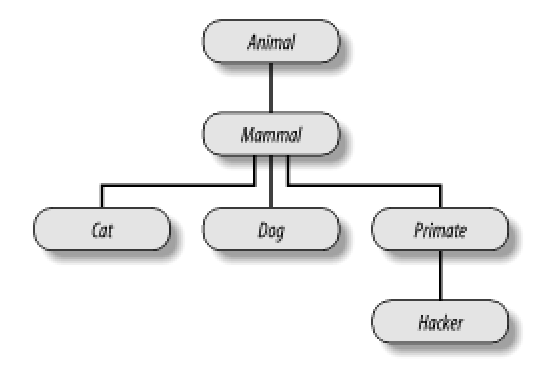
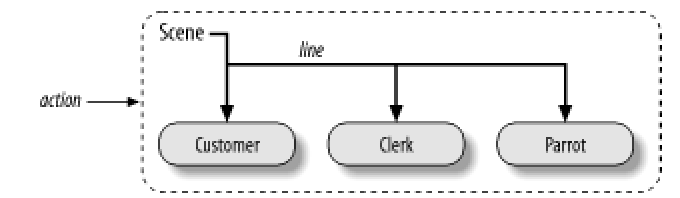

[返回“Python游戏开发基础”目录](<../Python游戏开发基础.qmd>)

## 温州大学课程教案

- 学院：计算机科学与学院
- 课程名称：游戏设计基础实验
- 学时：22
- 教材：Programming Python
- 授课教师：陈忠克
- 授课对象：计算机本科

## 第一课

### 授课时间：

2课时

### 授课类型：

实验课

### 授课题目：

Python 开发环境

### 本授课单元教学目标：

让学生掌握 Python 开发环境的基本使用

### 本授课单元教学重点和难点：

重点：编辑、运行Python程序

### 本授课单元教学过程设计：

- 在 http://www.python.org/ 上下载python安装程序安装Python
- 在 http://www.pygame.org/ 上下载pygame安装程序安装pygame
- 运行Python解释器，输入一些Python语句并查看运行结果。
- 下载安装一种Python编辑器，并熟悉它的使用。（比如SPE - Stani's Python Editor, IDLE, DrPython, Eclipse+PyDev, Boa Constructor,Emacs, VIM等）
- 运行编辑器，编辑一段Python代码，并运行它。
- 在 http://www.pygame.org/projects/6 下载一个Python游戏并运行它。

## 第二课

### 授课时间：

2课时

### 授课类型：

实验课

### 授课题目：

Python语言的数据类型

### 本授课单元教学目标：

让学生理解Python程序设计语言中的基本概念，掌握Python中基本数据类型和高级数据结构的使用

### 本授课单元教学重点和难点：

重点：Python语言的高级数据类型

### 本授课单元教学过程设计：

- 每种Python基本数据类型（bool, int, long, complex）创建一个变量，基本类型的各种运算和操作各写一个语句，并给出语句的执行结果
- 尝试以各种方式创建字符串对象，字符串对象的每种操作写一个语句，并给出运行的结果
- 尝试字符串替换操作，每种可能的字符串替换(%d,%f等等)写一个语句，并给出运行结果
- 创建一个列表list，列表的每种操作写一个语句，并给出运行的结果
- 创建一个元组tuple，元组的每种操作写一个语句，并给出运行的结果
- 创建一个字典dict，字典的每种操作写一个语句，并给出运行结果
- 在一个Python游戏（可以在pygame.org中找到的）中，找出使用各种数据类型的实例，并尝试解释它们的用途

## 第三课

### 授课时间：

4课时

### 授课类型：

实验课

### 授课题目：

Python语言的控制流

### 本授课单元教学目标：

让学生掌握Python的# 分支、循环结构的实现，函数的用法

### 本授课单元教学重点和难点：

重点：Python语言的函数

### 本授课单元教学过程设计：

- 编写一个分支结构，输入一个百分制分数，输出分数的等级（优、良、中、及格、不及格）
- 编写一个循环结构，对输入的一组整数进行排序。
- 在Python的交互方式下，写一个只有一个参数的函数，函数的功能只是简单的输出它的参数。然后调用这个函数，给它传各种不同类型的对象：字符串、整数、列表、字典等。然后再试试不给任何参数去调用它会发生什么。如果是给了两个参数去调用，那又会怎样呢？
- 在Python 文件中写一个adder函数，这个函数接受两个参数，并返回这两个参数的和。在文件的末尾用各种不同的参数（两个字符串、两个列表、两个浮点数等）调用这个函数，然后运行这个Python程序。在你要查看函数调用的结果时，你是否必须在每个函数调用前加上print？
- 让这个adder函数更加通用，使它可以计算任意个参数的和，并在调用时试着给不同个数的参数去调用它。这个函数的返回类型是什么？如果在调用时传进去的多个参数不是同一种类型的，那会发生什么？如果传进去的是一个字典，那又会怎样？
- 修改adder函数，使它可以接受三个参数def adder(good, bad, ugly)。为每个参数提供一个缺省值，然后试着以一个、两个、三个、四个参数去调用它，看会发生什么情况。然后试着使用关键字参数去掉用。adder (ugly=1, good=2)这样的调用可不可以用？为什么？最后，让这个adder函数可以接受任意个关键字参数。
- 定义六个函数
- 编写一组函数：一个square(x)函数计算并返回x的平方；一个average(x,y)函数，计算并返回x和y的平均值；一个 close_enough(x,y)函数，如果x和y很接近（它们之差的绝对值小于0.00...01）返回True否则返回False；一个 fix_point(f,guess)函数，让next=f(guess)，如果close_enough(next, guess)返回真，那么函数返回next，否则函数返回fix_point(f,next)；一个sqrt(x)函数，sqrt(x)= fix_point(lambda y:average(y,x/y),1.0)。试解释sqrt的功能和原理。
- 求这个列表[2, 4, 9, 16, 25]里每个数的平方根，并把它们保存在一个新的列表里面。尝试用三种方法来实现：1.用for循环来实现；2.用map函数来实现；3.用列表产生式来实现。使用math模块的sqrt函数来计算平方根（首先import math，然后math.sqrt(x)计算x的平方根）。在这三种方法中，你最喜欢哪一种方法？
- 下面的代码用了一个while循环和一个found标记，来在一个2的幂构成的列表中查找2的5次幂。

## 第四课

### 授课时间：

4课时

### 授课类型：

实验课

### 授课题目：

Python语言的类和对象

### 本授课单元教学目标：

让学生掌握Python类的类和对象的基本用法

### 本授课单元教学重点和难点：

重点：Python类的动态特性

### 本授课单元教学过程设计：

- 写一个叫做Adder的类，有一个方法叫做add(self, x, y)，这个方法只是打印"Not Implemented"其它什么也不做。然后定义两个子类来实现add方法：ListAdder类，它的add函数可以把两个列表连接在一起；DictAdder类，它的add方法可以把两个字典的内容合并成一个。试着创建三个类的对象，并调用它们的add方法。接着使用构造函数把数据赋给成员保存起来（比如说给self.data赋一个列表或者一个字典），并重载+运算符（__add__方法）来自动调用add方法（比如x+y就会触发x.add(x.data,y)）。把构造函数和运算符重载放在哪个类里面是最好的？什么样的对象可以和你的对象进行加法操作？实际上，你可能发现，让add函数只接受一个参数会更简单（例如add(self,y)），并把这个参数和对象本身的数据相加（比如 self.data+y）。这样的add函数比原来的add函数更合理吗？这样让你的类更显得面向对象吗？
- 写一个叫做Mylist的类，它包装了Python内部的列表。它可以进行大部分列表的操作，包括+、下标索引、迭代、切片，以及append、sort等方法。查看Python的曹考手册来查看list所有可能的操作。同时你的类可以用已有的列表作初始值来构造，给你的类添加一个构造函数来实现这个功能，把已有列表的数据拷贝到对象内部的成员中去。在交互界面下尝试你的类：

   - 为什么在构造时要对初始值进行拷贝？
   - 可以用空的切片（比如start[:]）来对初始值进行拷贝吗？
   - 可以有一个通用的方法把所有对Mylist的操作过渡给内部的列表吗？
   - 可以对一个Mylist对象和一个普通列表进行相加吗？两个顺序反一下可以吗？
   - +和切片操作应该返回什么类型的对象？索引操作呢？
   - 除了可以把一个普通列表作为成员实现Mylist以外，还可以通过继承内置的列表类来实现。哪种方法更简单？为什么？

- 写一个前面所作的Mylist类的子类MylistSub，在它的每个操作的开始增加一个打印信息的语句，并统计函数调用的次数。MylistSub应该从Mylist继承基本的操作。比如说连接操作，首先它打印一个消息，然后对计数器加1，最后调用父类的方法执行功能。增加一个方法，把操作计数器打印出来。在交互式界面下尝试你的类。你的计数器是对每个对象进行计数还是对每个类进行计数？如何两者都实现？
- 写一个叫做Meta的类，写一个方法拦截所有对成员的访问，并把参数打印到屏幕上。创建一个Meta类的对象，并尝试调用它。如果把这个对象用在表达式中，会发生什么事情？如果对它进行+、切片、索引操作会怎么样？
- 考虑如图所示的这个类图。用Python的继承对这六个类进行编程实现，然后给每个类增加一个speak方法，每个类打印一条个不相同的消息。给顶层的 Animal类增加replay方法，它只是简单的调用self.speak。最后把speak方法从Hacker类中移除。 
- 考虑如图所示的类结构。用一系列Python类来实现这个结构，Scene对象（戏剧中的一场）内嵌了Customer、Clerk、Parrot类的对象。让Scene类包含一个action方法（开始演出），而内嵌的Customer、Clerk、Parrot类的对象都有一个line方法（台词），打印出一条个不相同的消息。内嵌的对象要么从父类继承了一个line方法，或者自己定义了一个line方法。  最后，这样测试你的类
- 写一个排序二叉树BSTree类，实现类似集合的功能：insert插入一个元素、in判断元素是否在二叉树中，remove删除一个元素，union合并两个集合，intersect求两个集合的交集。

## 第五课

### 授课时间：

4课时

### 授课类型：

实验课

### 授课题目：

Pygame起步

### 本授课单元教学目标：

让学生了解 Pygame 运行环境的安装运行，掌握 Pygame 游戏的基本结构，掌握简单的 Pygame 游戏的编写

### 本授课单元教学重点和难点：

重点：Pygame的基本结构和使用方法

### 本授课单元教学过程设计：

- 安装Pygame及其文档和例子
- 在交互式界面中完成：
   - Pygame初始化，尝试以各种不同模式创建一个surface。
   - 试着在surface上填充各种不同的颜色，并把它显示出来。
   - 试着载入一个图片（比如扑克或者麻将等），并在屏幕上显示出来。尝试将这张图片在屏幕上的不同位置显示出来。尝试将这种图片旋转、翻转、缩放并显示出来。
   - 试着将图片的一部分在屏幕上显示。试着将这个图片的不同部分在屏幕上的不同位置显示。试着将整副扑克或者麻将等在屏幕上显示出来。
   - 尝试写一个定时器，隔一定时间对图片进行平移、旋转、翻转、缩放显示。
   - 尝试读取用户的键盘输入，并用不同的键控制屏幕上图片的位置、旋转、翻转、缩放显示。
- 将以上这些功能写入一个程序文件，并试着加入一些有趣的功能，完成第一个游戏的制作。

## 第六课

### 授课时间：

4课时

### 授课类型：

实验课

### 授课题目：

Pygame图形接口基础

### 本授课单元教学目标：

让学生了解Pygame中图形绘制的方法，Pygame中文字绘制的方法，图像的处理方法

### 本授课单元教学重点和难点：

重点：Pygame图形和文字的绘制

### 本授课单元教学过程设计：

- 创建各种不同像素类型的Surface，对它们进行操作并显示，比较效果有何不同
- 设置Surface的透明属性，并将其显示出来，比较不同的透明方式的效果
- 设置Surface的剪切区域后对Surface进行操作，查看效果
- 在Surface上画各种不同的矩形、圆形、椭圆、弧线、多边形，查看效果
- 在Surface上画很多个点，比较使用Lock和不用Lock的效率
- 在Surface上用不同的字体、大小、位置画同一串字符串，查看效果。试试设置粗体、斜体、下划线的效果。

## 第七课

### 授课时间：

2课时

### 授课类型：

实验课

### 授课题目：

Pygame多媒体

### 本授课单元教学目标：

让学生掌握Pygame音乐、声效、视频、CD的使用方法

### 本授课单元教学重点和难点：

重点：Python的音乐和音效

### 本授课单元教学过程设计：

   - 用pygame的音乐接口播放一个背景音乐，尝试播放各种不同格式的背景音乐，尝试调节音量、控制进度，尝试在一个音乐播放完后自动开始下一个音乐的播放
   - 用pygame的音效接口播放一个音效，控制它的音量、控制进度
   - 同时播放多个音效
   - 用pygame的视频接口播放一段视频，尝试对它调节音量、控制进度。
   - 尝试用pygame播放一个音乐CD，控制播放的进度，调节播放的音量。
   - 尝试修改窗口的标题、窗口的图标，尝试可以用一个键在全屏和窗口之间切换
